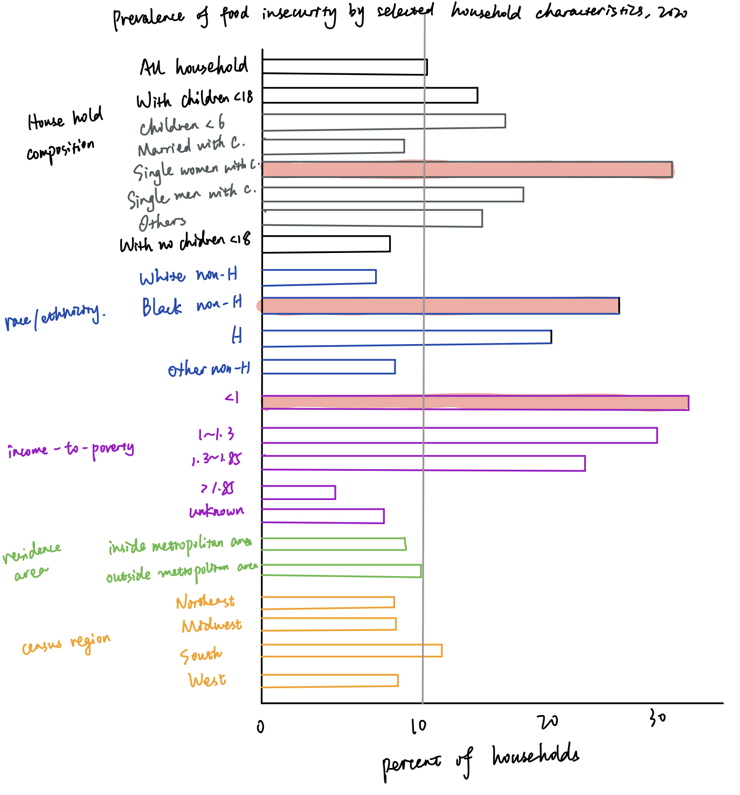

### Original data visualization

Source: [USDA, Economic Research Service](https://www.ers.usda.gov/topics/food-nutrition-assistance/food-security-in-the-u-s/key-statistics-graphics/)

This visualization describes the food insecurity among different house hold types, which includes characteristics about household composition, race, income-to-proverty ratio, residence area, and census region. It is from a public source and provides raw data in excel as well. Though it is a complete visualization, I did notice something to improve to make it more straight-forward, more content-related, and more user-friendly.

### Critique the visualization

I used Stephen Few's [Data Visualization Effectiveness Profile](http://www.perceptualedge.com/articles/visual_business_intelligence/data_visualization_effectiveness_profile.pdf) to critique the visualiation. It evaluated the visualization from usefulness, completeness, perceptibility, truthfulness, intuitiveness, aesthetics, and engagement. Besides, it guided me to think from the perspective of primary audience. I concluded the visualization was poor in perceptibility and aesthetics. I also evaluated whether it was concise enough, which was not included in the critique method.

### Wireframe a solution

Based on my critique, I planned to improve the visualization in several ways:
1. Use different colors to distinguish different characteristics
2. Abandon unnecessary household groups and make the each group comparable
3. Adjust some household groups, e.g. income-to-poverty. The original visualization includes "under 1.00", "under 1.30", and "under 1.85", which are overlapped. Based on the original data, I did further calculation and changed the groups to "under 1.00", "1.00-1.30", and "1.30-1.85".
4. Highlight the household groups that have extremely high food insecurity, which may need more attention
5. Use annotation to highlight the national average food insecurity (10.5), as it compares food insecurity of each household type to the national average in the article

Below is my wireframe solution:

### Test the solution
I shared my wireframe with two friends. They easily figured out what the wireframe was talking about. At the same time, they provided some suggestions on further improvement.
1. The characteristic of residence area seems redundant as the two groups have little difference and both are below the average.
2. Is it necessary to put all groups/characteristics in the same graph? Those groups are not comparable. Besides, too many y labels make reader unable to catch the point at the first time.

Based on their feedback, I further adjusted the household groups. I abandoned the residence area characteristics and seperated each characteristic into different graphs.

### Final solution
Below my final redesign solution.

In this visualiation, I intend to show the food insecurity across different household characteristics. They are compared to the national average insecurity of all households. Specifically, I have marked household groups that have extremely high food insecurity in each characteristic category, which may interest those researchers/policy makers/sociologists as identified as primary audience.

Back to the [main portfolio page](https://tracycccc.github.io/tracy-data-visualization/).
